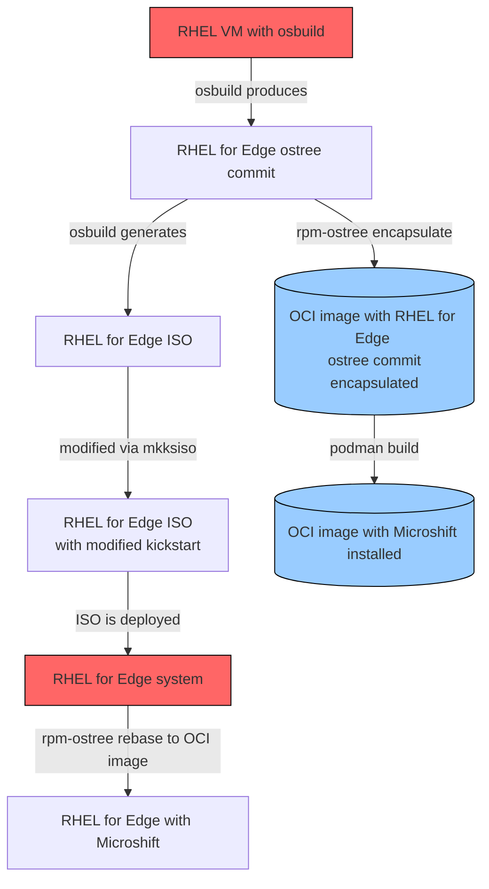

# Delivering Microshift via OCI container image

This is an **aspirational** example of using [ostree native containers](https://coreos.github.io/rpm-ostree/container/) to deliver a RHEL for Edge OS update that includes [Microshift](https://microshift.io) and required configuration.

:warning: I repeat, this is **ASPIRATIONAL** as in, this currently **does not work** given the constraints of the Microshift requirement of RHEL 8.7, where there are issues that exist which prevent this from being successful.

It assumes that you have access to RHEL/Microshift content and are able to run [`osbuild`](https://osbuild.org) in order to produce a starting RHEL for Edge image.  It is advisable to use a RHEL 8 based RHEL system to run `osbuild` and build RHEL for Edge artifacts using RHEL 8 content.

There's likely a lot of room for streamlining (maybe an Ansible playbook?) to do a lot of this heavy lifting, but I prefer to be verbose and show the steps along the way.  Patches welcome!

## Flowchart

I'm doing this to practice with [Mermaid](https://mermaid.js.org)




## Build RHEL for Edge starter

On your RHEL system running `osbuild`, we need to create two blueprints:

1. a vanilla blueprint for the base ostree commit
2. a vanilla blueprint for the ISO installer

```bash
$ cat minimal.toml
name = "minimal"
description = "minimal rhel for edge blueprint"
version = "1.0.0"
distro = "rhel-87"
```

```bash
$ cat iso.toml
name = "iso"
description = "blueprint to create RHEL for Edge ISO"
version = "1.0.0"
distro = "rhel-87"
```

Push both blueprints to the server:

```bash
$ composer-cli blueprint push minimal.toml
$ composer-cli blueprint push iso.toml
```

Build the initial ostree commit:

```bash
$ composer-cli compose start minimal edge-commit
```

Download the ostree commit, explode to disk, serve via HTTP

```bash
$ composer-cli compose image 87c7cab8-528e-45b6-a244-d9a2f25c1207
$ tar -xvf 87c7cab8-528e-45b6-a244-d9a2f25c1207.tar
$ cd repo
$ python3 -m http.server
```

Generate the ISO

```bash
$ composer-cli compose start-ostree iso edge-installer --url http://localhost:8000
```

Download the ISO and replace the kickstart in the ISO.  (We skip putting the customizations in the blueprints earlier since the `osbuild` generated kickstart gets replaced with one that does the LVM disk partitioning required for Microshift.)

```bash
# dnf -y install lorax
# composer-cli compose image eafa8131-2f02-4147-a76c-d6e6eb2b716f
# mkksiso microshift.ks r4e-installer.iso r4e-customized-installer.iso
```

Install RHEL for Edge using the newly generated ISO on a separate system.  (This is not covered here...)

## Generate the RHEL for Edge base container image

You can take an existing `ostree` repo and encapsulate it into an OCI image using `rpm-ostree compose container-encapsulate`.
The version of `rpm-ostree` that is included in RHEL 8/9 (as of this writing 16-Mar-2023) does not include this functionality, so you can work around it by using a Fedora container image to get a newer version of `rpm-ostree`

```bash
$ cat Containerfile.rpmostree
FROM registry.fedoraproject.org/fedora:37
RUN dnf -y upgrade && \
    dnf -y install rpm-ostree && \
    dnf clean all
```

Build your custom container image:

```bash
$ podman build -t localhost/rpm-ostree -f Containerfile.rpmostree .
```

We are going to encapsulate the existing `ostree` repo and push it to a container registry, so we'll mount our registry push/pull secret into the container during the encapsulate process. We also mount the `ostree` repo in to operate on.

```bash
$ podman run --rm -it -v ~/.docker/config.json:/root/.docker/config.json:z -v ./repo:/host/repo:z localhost/rpm-ostree rpm-ostree compose container-encapsulate --repo=/host/repo rhel/8/x86_64/edge docker://quay.io/miabbott/rhel-for-edge:8.7
```

## Build the custom Microshift container image

:warning: I haven't tested if embedding the entitlement stuff works during a build, but theoretically it should :crossed_fingers:

Now we can use the newly pushed RHEL for Edge container image as a base layer for our customized Microshift image.

It is expected that you have populated the local `etc` directory with the following:

- `etc/crio/openshift-pull-secret` with your OpenShift [pull secret from console.redhat.com](https://console.redhat.com/openshift/install/pull-secret)
- `etc/yum.repos.d/` with repo file(s) for RHEL 8 content, OpenShift 4.12 content, and RHEL 8 Fast Data Path content
- `etc/pki/entitlement/` with your RHSM SSL client cert + client key
- `etc/rhsm/ca/` with your RHSM CA certificate

(The certs and keys could be optional if you have an unsecured mirror of all the Red Hat content; this should only be the case if you are a Red Hat employee behind the corporate firewall.)

```bash
$ cat Containerfile.microshift
FROM quay.io/miabbott/rhel-for-edge:8.7
COPY etc /etc
RUN rpm-ostree install microshift && \
    systemctl enable microshift && \
    rm -rf /etc/{pki,rhsm,yum.repos.d} && \
    ostree container commit
```

Build it!

```bash
$ podman build -t quay.io/miabbott/rhel-for-edge:8.7-microshift -f Containerfile.microshift .
$ podman push quay.io/miabbott/rhel-for-edge:8.7-microshift
```

:warning: This is where things failed for me.  I ran into the following errors:

<details><summary>Click to expand the errors</summary>

```text
Installing: microshift-selinux-4.12.7-202303082246.p0.g5be591c.assembly.4.12.7.el8.noarch (rhocp-4.12)
libsemanage.semanage_commit_sandbox: Error while renaming /etc/selinux/targeted/active to /etc/selinux/targeted/previous. (Invalid cross-device link).
/usr/sbin/semodule:  Failed!
Installing: cri-o-1.25.2-10.rhaos4.12.git0a083f9.el8.x86_64 (rhocp-4.12)
Installing: cri-tools-1.25.0-2.el8.x86_64 (rhocp-4.12)
Installing: unbound-libs-1.16.2-2.el8.x86_64 (appstream)
Installing: python3-ptyprocess-0.5.2-4.el8.noarch (appstream)
Installing: python3-pexpect-4.6-2.el8ar.noarch (rhocp-4.12)
Installing: NetworkManager-ovs-1:1.40.0-5.el8_7.x86_64 (baseos)
Installing: python3-magic-5.33-21.el8.noarch (baseos)
Installing: numactl-libs-2.0.12-13.el8.x86_64 (baseos)
Installing: libnetfilter_queue-1.0.4-3.el8.x86_64 (baseos)
Installing: libnetfilter_cthelper-1.0.0-15.el8.x86_64 (baseos)
Installing: python3-chardet-3.0.4-7.el8.noarch (baseos)
Installing: python3-pysocks-1.6.8-3.el8.noarch (baseos)
Installing: python3-urllib3-1.24.2-5.el8.noarch (baseos)
Installing: python3-idna-2.5-5.el8.noarch (baseos)
Installing: python3-requests-2.20.0-2.1.el8_1.noarch (baseos)
Installing: libnetfilter_cttimeout-1.0.0-11.el8.x86_64 (baseos)
Installing: conntrack-tools-1.4.4-10.el8.x86_64 (baseos)
Installing: bzip2-1.0.6-26.el8.x86_64 (baseos)
Installing: python3-pyyaml-3.12-12.el8.x86_64 (baseos)
Installing: sos-4.5.0-1.el8.noarch (baseos)
Installing: openvswitch-selinux-extra-policy-1.0-30.el8fdp.noarch (fast-datapath)
libsemanage.semanage_commit_sandbox: Error while renaming /etc/selinux/targeted/active to /etc/selinux/targeted/previous. (Invalid cross-device link).
/usr/sbin/semodule:  Failed!
Installing: openvswitch2.17-2.17.0-77.el8fdp.x86_64 (fast-datapath)
Installing: microshift-networking-4.12.7-202303082246.p0.g5be591c.assembly.4.12.7.el8.x86_64 (rhocp-4.12)
System has not been booted with systemd as init system (PID 1). Can't operate.
Failed to connect to bus: Host is down
System has not been booted with systemd as init system (PID 1). Can't operate.
Failed to connect to bus: Host is down
Installing: microshift-4.12.7-202303082246.p0.g5be591c.assembly.4.12.7.el8.x86_64 (rhocp-4.12)
System has not been booted with systemd as init system (PID 1). Can't operate.
Failed to connect to bus: Host is down
error: Error -1 running transaction
Error: building at STEP "RUN rpm-ostree install microshift &&     systemctl enable microshift &&     ostree container commit": while running runtime: exit status 1
```

</details>

This lead me down the rabbit hole of <https://github.com/coreos/rpm-ostree/issues/3449> -> <https://github.com/SELinuxProject/selinux/issues/343> -> <https://github.com/SELinuxProject/selinux/commit/c7a3b93e31df312ed5b71436ec874054a95d4209>

TL;DR: it's a bug in `libsemodule` that is fixed in version 3.4, but RHEL 8.7 is shipping version 2.9 and it doesn't appear to be backported to that version.  :shrug:

Additionally, it looks like the Microshift packaging attempts to run [`systemctl restart` as part of the `%post`](https://github.com/openshift/microshift/blob/7015c8c5a11c7a88920f4287b4076915ffdbac0f/packaging/rpm/microshift.spec#L216-L222)

## Rebase your RHEL for Edge system

:warning: This part is theoretical, since I've not been able to successfully build the container yet. :sob:

On your RHEL for Edge system that you installed earlier:

Copy your registry pull secret to `/etc/ostree/auth.json` and then use `rpm-ostree rebase`

```bash
$ sudo rpm-ostree rebase --experimental ostree-unverified-registry:quay.io/miabbott/rhel-for-edge:8.7-microshift
$ sudo systemctl reboot
```
